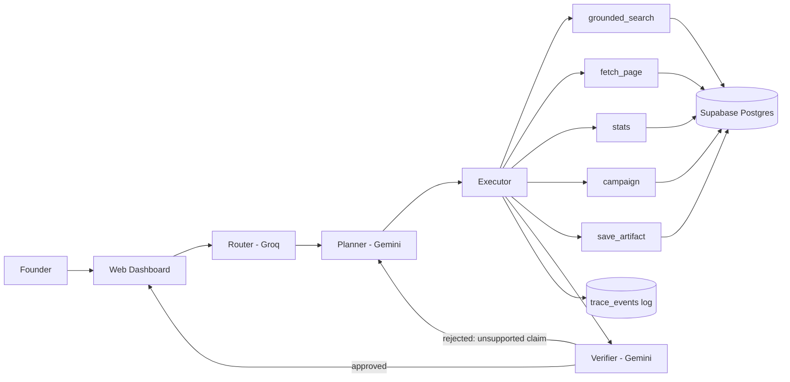

# AI-OS Validation Copilot — Master Build Specification
**Version:** 2.1
**Status:** Ready for implementation — build plan locked to a solo, 2–3 day window
**Supersedes / extends:** `AI_OS_Hackathon_Technical_Specification_v1_0.md` (the v1.0 runtime spec is still valid — this document narrows it into a shippable product and adds everything v1.0 did not cover: product scope, data model, compliance, evaluation, build plan, and the platform/roadmap framing added in v2.1, Section 4.1)

---

## 0. How to Use This Document

This file is written to be handed directly to an AI coding agent (Claude Code) as the primary build reference. It is intentionally complete: product rationale, architecture, data model, tool/skill contracts, compliance rules, evaluation method, and a phased build plan.

**Rules for the builder (human or agent):**
1. Do not build features outside the P0/P1 scope in Section 4 without explicit sign-off — see Section 16 for the freeze point.
2. Every claim the system outputs to a user must be traceable to a source or explicitly marked "insufficient evidence." This is non-negotiable — see Section 12.
3. Any action in Section 10 marked **L3** requires human approval before execution. Do not build a code path that skips this.
4. When a decision in this spec is marked `[OPEN]`, resolve it with the project owner before writing code that depends on it — do not silently assume.
5. Read Section 21 (References) before implementing the provider integrations, the compliance layer, and the evaluation harness — the linked docs contain details (exact schemas, rate limit numbers, legal text) that are load-bearing and change over time.

---

## 1. Executive Summary

**Product:** Validation Copilot — an AI agent that helps startup founders (any domain) validate an idea before they spend months and money building the wrong thing.

**What it does, in one loop:**
1. Takes a founder's idea in free text.
2. Builds a risk-ranked map of the assumptions the idea depends on.
3. Gathers **secondary evidence** (grounded web research, cited) about the market, competitors, and pricing.
4. Designs a cheap validation experiment (interview script, survey, or landing page) for the riskiest assumption, and screens the questions for bias before use.
5. Collects **primary evidence** — real responses from real, consenting people — and analyzes it.
6. Produces a decision memo (**Go / Iterate / Stop / Test More**) with an explicit confidence level, the evidence behind it, and the next cheapest experiment.

**Why this wins the hackathon and survives after it:** it doesn't just answer questions about a startup — it does the two things most founders skip (rigorous secondary research and real primary evidence collection) and refuses to call something "validated" without real user evidence. The methodology is domain-agnostic; the domain knowledge is fetched at run time via grounded search, so the same core product scales to any vertical without retraining or rearchitecting.

**Relationship to the v1.0 spec:** v1.0 described a general-purpose, provider-agnostic agent runtime (Router → Planner → Executor → Verifier, MCP/A2A, Telegram demo channel). This document keeps that runtime design but points it at one product instead of an open-ended runtime, cuts MCP/A2A/multi-agent from the MVP, and replaces Telegram with a web dashboard (the demo needs to show source tables, confidence scores, and the trace log — a chat window can't).

**Product framing (why the name doesn't change):** the long-term vision is a founder co-pilot that goes beyond validation — into brand/identity, customer communication, and business health (Section 4.1). Validation Copilot is deliberately **Skill Pack #1** of that platform, not a rebrand-in-waiting: the runtime and trust layer are already problem-agnostic, so the platform grows by adding Skill Packs, not by renaming or rearchitecting this submission. Given the 2–3 day, solo build window (Section 16), keep the name and all deck/document references exactly as they are — a rename now spends hours on zero added judging value.

---

## 2. Problem Statement & Vision

Most startup failure is not a funding problem or an execution problem — it is a **validation problem**: founders build based on opinions (their own, their friends', their potential customers' polite lies) instead of evidence, and find out too late. The two hardest, most commonly skipped steps are:
- **Structured assumption testing** before building (What exactly are we betting on? Which bet is riskiest?).
- **Primary evidence collection** — talking to and testing with real prospective customers, not just reading about the market.

**Vision:** a founder describes an idea in any domain, and within one session has (a) a clear map of what needs to be true for it to work, (b) a grounded picture of the market, and (c) a real, in-flight experiment collecting evidence from real people — with the system refusing to overstate what the evidence actually shows.

**Founder's personal motivation (informs tone and defaults):** built from firsthand experience running two prior startups where validation and product-market fit were the hardest, costliest problems — the product should actively prevent the mistakes that experience revealed, not just document them after the fact.

---

## 3. Target User & Golden Demo Path

**Primary user:** an early-stage founder (pre-product or pre-PMF), solo or small team, any industry.

**The golden path (this is the only flow that must work flawlessly for the demo):**

| Step | What happens | System component |
|---|---|---|
| 1. Intake | Founder describes idea in free text; system extracts domain, target customer, stage, business model; asks ≤3 clarifying questions | `startup-intake` skill |
| 2. Assumption map | System produces a risk-ranked list of assumptions (desirability / viability / feasibility) with reasoning | `assumption-mapping` skill |
| 3. Secondary research | Grounded web search on market, competitors, pricing — every claim cited or marked unsupported | `market-research` skill + `grounded_search` tool |
| 4. Experiment design | Cheapest test for the riskiest assumption: interview script or survey; every question passes a leading-question check before being shown | `experiment-designer` + `survey-designer` skills |
| 5. Primary evidence loop | Founder-approved outreach to a founder-supplied, consented list; replies collected and analyzed; OR founder uploads real interview notes/results | `outreach-composer` + `response-analyzer` skills |
| 6. Decision memo | Go / Iterate / Stop / Test More, with confidence, sample size, response rate, and evidence links | `decision-memo` skill |

A **trace panel** alongside the main flow shows every tool call, every source, and every verifier check in real time — this is what proves "no hallucination" to the judges live, rather than asking them to take it on faith.

---

## 4. Scope Definition

| Tier | Contents |
|---|---|
| **P0 — must work for the demo** | Runtime (Router/Planner/Executor/Verifier) with budget guard; grounded search; assumption mapping; leading-question validator; primary-evidence analysis from founder-uploaded data (CSV / pasted notes); decision memo; full trace log; web dashboard |
| **P1 — build if time allows, after P0 is solid** | Live email outreach campaign (single channel) with consent capture, send cap, unsubscribe link, and reply classification |
| **P2 — explicitly post-hackathon roadmap** | WhatsApp/SMS outreach (requires Egypt PDPL electronic-marketing license — see Section 11), MCP/A2A integrations, multi-agent orchestration, the three Roadmap Skill Packs below (Section 4.1), automated self-improvement pipeline |

**Do not build P2 items during the hackathon.** Present them as a designed roadmap in the pitch instead (Section 4.1) — judges reward a working narrow product over a half-built ambitious one.

---

### 4.1 Roadmap Skill Packs (Designed, Not Built for the Hackathon)

**Product framing:** Validation Copilot is not the whole product — it is **Skill Pack #1** of a broader founder co-pilot platform. The Router/Planner/Executor/Verifier runtime and the trust layer (Section 12) are already problem-agnostic; adding a new problem area means adding a new Skill Pack (playbooks + tools + evidence model + golden tasks) on top of the same runtime, never rebuilding it. The three packs below are specified at the level needed to pitch and to start building next — not at the full depth of Section 8, since none of them is built for this submission.

**Cross-cutting principle for every pack (including future ones):** the system works *with* the founder, never *for* them alone — every consequential output is a set of confidence-scored options via the L0–L3 approval model (Section 10), not an autonomous decision. This is what makes "co-founder-grade partner" a credible claim rather than a slogan.

| Pack | Purpose | Key skill(s) | Evidence it relies on | One acceptance criterion |
|---|---|---|---|---|
| **Brand & Identity** | Help a founder name, position, and visually identify their company | `positioning-brief`, `identity-direction` | Founder's own stated audience/values + grounded competitor-branding research | Never outputs a final logo/name as "the" answer — always 3 directions with the reasoning behind each, for the founder to choose |
| **Customer Communication** | Draft and triage real customer messages (support, follow-ups, objections) in the founder's voice | `reply-drafter`, `tone-matcher` | The founder's own past messages (style) + the specific customer thread (content) | Never invents a policy, price, or promise not present in founder-approved facts — reuses the L3 approval gate from Section 10 before anything sends |
| **Business Health Check-in** | Periodic plain-English read of whatever data is connected (sales, engagement, churn signals) with a ranked "what needs attention" list | `health-scan`, `signal-ranker` | Only the founder's own connected data — never inferred or estimated figures | Every flagged risk names the metric and the threshold that triggered it — no vague "growth looks slow" without a number behind it |

**Continuity Layer** (architecture, not a pack — see Section 5.4): the persistent per-startup memory that makes every pack above feel like the same partner, not a new tool each time.

---

## 5. System Architecture

### 5.1 Runtime Loop

A single agent loop, not a swarm — the v1.0 spec's own guidance to start with 3–5 tools and grow later applies to skills as well.

```
User input → Router (classify intent, pick skill) 
           → Planner (break into tool calls, using the active skill's playbook)
           → Executor (call tools, one at a time, with retries/backoff)
           → Verifier (check every claim against retrieved sources; block on unsupported claims)
           → Response + Trace event log
```

- **Router:** fast, cheap model (Groq) — classifies which skill applies and whether the action is L0–L3 (Section 10).
- **Planner / final synthesis:** stronger model (Gemini) — produces the assumption map, the memo, and any user-facing prose.
- **Executor:** deterministic code, not a model — calls tools, applies retry/backoff, enforces budgets.
- **Verifier:** a separate model call (or deterministic rule where possible) that checks the Planner's output against the actual tool results before it reaches the user. This is what catches unsupported claims.

### 5.2 Component Diagram



### 5.3 Evidence Model

This is the intellectual core of the product and must be enforced in code, not just in prompts.

**Evidence types:**
- **Secondary evidence** — desk research (grounded search, competitor pages, published pricing). Useful for forming hypotheses. Never sufficient alone to declare an assumption validated.
- **Primary evidence** — data from actual prospective customers: interview notes, survey responses, sign-ups, pre-orders, usage data.

**Commitment ladder (weakest → strongest), used to weight primary evidence:**
1. Opinion ("that sounds useful")
2. Stated future intent ("I would probably use that")
3. Time given (agreed to a call, filled a multi-question survey)
4. Contact info shared voluntarily
5. Money or a hard commitment (pre-order, deposit, signed LOI, actual product usage)

**Hard rule enforced by the Verifier and the `decision-memo` skill:** the system may never output a "validated" / "strong Go" verdict based on secondary evidence alone, or based on primary evidence below rung 3 of the ladder, or with a sample size below the threshold set in the skill's acceptance criteria (Section 8). If evidence is thin, the correct output is "Test More" with a named next experiment — not an inflated verdict.

### 5.4 Continuity Layer

This is what turns "a tool that answers questions" into "a partner that knows your company" — and it is cheap, because the Section 9 data model (`startups`, `assumptions`, `evidence`, `decisions`) already carries everything it needs. The layer itself is a UI/retrieval discipline, not new infrastructure:

- **Every session opens on the startup's own history**, not a blank page: its current assumptions, its last decision memo, its open experiments.
- **Every new answer is written in light of that history** — e.g., a new piece of evidence is checked against the assumption it was meant to test, not analyzed in isolation.
- **The system never acts alone on the founder's behalf** for anything above L1 (Section 10) — it proposes, the founder decides. This is the concrete mechanism behind "works with founders, not instead of them," and it is already enforced by the approval-level design, not something new to build.

This layer is what every Roadmap Skill Pack (Section 4.1) plugs into — a new pack adds new skills and tools, but reads and writes the same per-startup memory, so the founder never has to re-explain their company to a "new" module.

---

## 6. AI Provider Strategy

### 6.1 Gemini — planning, verification, synthesis, grounded research
- Use for: assumption mapping, market research synthesis, the decision memo, and the Verifier pass.
- Use the **`google_search` grounding tool** for all market/competitor claims — this is the single highest-leverage feature against hallucination (see Section 21-A).
- Request **structured JSON output** via `responseSchema` for every skill that produces machine-readable results (assumption list, evidence records, memo) — do not rely on the model to format free text reliably (Section 21-A).
- **Do not rely on the free tier for the live demo.** The free tier is capped at a small number of requests per minute and per day; a `429` mid-demo is a real risk. Move to a paid key before rehearsal. (Verify current limits yourself in Section 21-B before locking budgets — they change.)
- **Data handling note:** free-tier traffic may be used by Google to improve their products. Do not send real founders' confidential ideas through the free tier in anything beyond the hackathon demo.

### 6.2 Groq — routing, classification, fast responses
- Use for: intent routing, reply classification (interested / not interested / unsubscribe / needs human), and any low-stakes, high-volume classification step.
- Groq enforces **RPM, RPD, TPM, and TPD limits simultaneously** at the organization level — hitting any one returns a 429. Read the rate-limit headers on every response and implement backoff (Section 21-B has the exact header names and a reference implementation pattern).

### 6.3 Provider Config & Fallback

```yaml
providers:
  planner:
    primary: { name: gemini, model: "gemini-3.8-flash", tools: [google_search] }
    fallback: { name: gemini, model: "gemini-2.5-flash" }
  router:
    primary: { name: groq, model: "llama-3.3-70b-versatile" }
    fallback: { name: groq, model: "llama-3.1-8b-instant" }
  verifier:
    primary: { name: gemini, model: "gemini-3.8-flash" }
budgets:
  max_cost_usd_per_task: 0.50   # tune after golden-task run; see Section 13
  max_tool_calls_per_task: 15
  hard_timeout_seconds: 90
```
Every model ID above must be re-verified against current provider docs before use (Section 21-B) — model names and versions change faster than this document will be updated.

---

## 7. Tool Specifications

Five tools only for the MVP — more tools measurably degrade routing accuracy (v1.0 spec, §8.3, and general agent-design guidance in Section 21-A).

### `grounded_search`
- **Input:** `{ query: string, domain_hint?: string }`
- **Output:** `{ results: [{ claim: string, url: string, published_at?: string }] }`
- **Behavior:** wraps Gemini's `google_search` grounding tool; every returned claim must carry a source URL. No URL → not returned as a claim.

### `fetch_page`
- **Input:** `{ url: string }`
- **Output:** `{ text: string, url: string, fetched_at: timestamp }`
- **Behavior:** for reading a specific competitor/pricing page found via search. Respect robots.txt; timeout at 10s; on failure, return an explicit error object, never fabricated content.

### `stats`
- **Input:** `{ operation: "sample_stats" | "sean_ellis_score" | "response_rate" | "confidence_interval", data: number[] | object }`
- **Output:** deterministic numeric result, computed in code — never by the model.
- **Behavior:** all arithmetic (sample sizes, percentages, response rates, the Sean Ellis "very disappointed" percentage — Section 21-D) goes through this tool. The model never does math in free text that reaches the user.

### `campaign`
- **Input:** `{ action: "create_lead" | "log_consent" | "queue_message" | "get_status", payload: object }`
- **Output:** operation result + updated row from Supabase.
- **Behavior:** the only tool allowed to touch `leads` and `messages` tables. Enforces consent-gate and idempotency (Section 9, Section 11) at the code level, not just the prompt level.

### `save_artifact`
- **Input:** `{ type: "assumption_map" | "experiment_design" | "decision_memo", content: object }`
- **Output:** `{ id: uuid, url: string }`
- **Behavior:** persists to Supabase and returns a link the dashboard can render.

---

## 8. Skills Library

Each skill is a loaded playbook (instructions + examples + acceptance criteria), not a separate model or agent. Load only the active skill's playbook into context per the v1.0 spec's context-management guidance.

| # | Skill | Purpose | Key acceptance criteria |
|---|---|---|---|
| 1 | `startup-intake` | Extract domain, customer, stage, business model from free text; ask ≤3 clarifying questions | Produces valid `Startup` record; never asks more than 3 questions; never guesses a fact it should ask about |
| 2 | `assumption-mapping` | Produce a risk-ranked assumption list (desirability/viability/feasibility) | Every assumption has a stated reason for its risk ranking; ≥1 assumption per category where applicable |
| 3 | `market-research` | Grounded research on market size, competitors, pricing | 100% of factual claims carry a citation from `grounded_search`; ungrounded claims are labeled "insufficient evidence," never asserted |
| 4 | `survey-designer` | Draft interview questions / survey items; **includes the leading-question validator** | Rejects any question implying a desired answer (e.g. "Don't you think X would be useful?"); rejects hypothetical-only questions with no past-behavior question present; flags sample size <15 as too small to conclude |
| 5 | `experiment-designer` | Pick the cheapest experiment that tests the riskiest assumption | Never recommends a full build as the first test; ranks options by cost and evidence strength (Section 5.3 ladder) |
| 6 | `outreach-composer` | Draft outbound email copy for an approved campaign (P1) | Copy includes business name, clear opt-out link, and no claims not present in the founder-approved facts; never sends — only drafts, pending L3 approval |
| 7 | `response-analyzer` | Analyze real replies/survey data/uploaded notes | Distinguishes compliments from commitments (Section 5.3); computes response rate via `stats` tool, never estimates it |
| 8 | `decision-memo` | Produce the final Go/Iterate/Stop/Test More verdict | Cannot output "Go" or "validated" language without ≥1 rung-3+ primary evidence item and the sample-size threshold met; always names the next cheapest experiment if verdict is not "Go" |

---

## 9. Data Model (Supabase / Postgres)

```sql
-- Startups: one row per venture being evaluated
create table startups (
  id uuid primary key default gen_random_uuid(),
  owner_id uuid not null references auth.users(id),
  name text not null,
  one_liner text not null,
  domain text not null,
  target_customer text,
  stage text not null default 'idea',        -- idea | prototype | live | scaling
  business_model text,
  created_at timestamptz not null default now(),
  updated_at timestamptz not null default now()
);

-- Assumptions: the risk map
create table assumptions (
  id uuid primary key default gen_random_uuid(),
  startup_id uuid not null references startups(id) on delete cascade,
  statement text not null,
  category text not null,                    -- desirability | viability | feasibility
  risk_level text not null,                  -- critical | high | medium | low
  status text not null default 'untested',   -- untested | testing | validated | invalidated
  created_at timestamptz not null default now()
);

-- Evidence: secondary and primary, always source-tagged
create table evidence (
  id uuid primary key default gen_random_uuid(),
  startup_id uuid not null references startups(id) on delete cascade,
  assumption_id uuid references assumptions(id),
  evidence_type text not null,               -- secondary | primary
  source_type text,                          -- web_search | interview | survey | preorder | usage_data
  source_url text,
  claim text not null,
  strength text not null,                    -- opinion | intent | time_given | contact_shared | commitment
  sample_size int,
  collected_at timestamptz not null default now()
);

-- Experiments: validation designs, must be approved before running
create table experiments (
  id uuid primary key default gen_random_uuid(),
  startup_id uuid not null references startups(id) on delete cascade,
  assumption_id uuid references assumptions(id),
  type text not null,                        -- interview | survey | landing_page | presale
  design jsonb not null,                     -- questions / script / page copy
  status text not null default 'draft',      -- draft | approved | running | completed
  approved_by uuid references auth.users(id),
  approved_at timestamptz,
  created_at timestamptz not null default now()
);

-- Leads: consented contacts only — see Section 11 before writing any insert path
create table leads (
  id uuid primary key default gen_random_uuid(),
  startup_id uuid not null references startups(id) on delete cascade,
  email text,
  phone text,
  source text not null,                      -- founder_list | signup_form | community
  consent_given boolean not null default false,
  consent_timestamp timestamptz,
  consent_text text,                         -- exact wording shown at opt-in, for the audit log
  unsubscribed boolean not null default false,
  created_at timestamptz not null default now()
);

-- Messages: full audit trail of every outbound/inbound message
create table messages (
  id uuid primary key default gen_random_uuid(),
  lead_id uuid not null references leads(id) on delete cascade,
  experiment_id uuid references experiments(id),
  direction text not null,                   -- outbound | inbound
  channel text not null,                     -- email | whatsapp (P2)
  template_id text,
  body text not null,
  status text not null default 'queued',     -- queued | sent | delivered | replied | bounced | failed
  idempotency_key text unique,
  sent_at timestamptz,
  created_at timestamptz not null default now()
);

-- Decisions: the memo history for a startup
create table decisions (
  id uuid primary key default gen_random_uuid(),
  startup_id uuid not null references startups(id) on delete cascade,
  verdict text not null,                     -- go | iterate | stop | test_more
  confidence text not null,                  -- low | medium | high
  rationale text not null,
  evidence_ids uuid[] not null default '{}',
  sample_size int,
  response_rate numeric,
  created_at timestamptz not null default now()
);

-- Trace events: full observability for the demo trace panel
create table trace_events (
  id uuid primary key default gen_random_uuid(),
  startup_id uuid references startups(id) on delete cascade,
  actor text not null,                       -- router | planner | executor | verifier | skill:<name>
  event_type text not null,                  -- tool_call | tool_result | verification | decision | error
  payload jsonb not null,
  cost_usd numeric,
  latency_ms int,
  created_at timestamptz not null default now()
);
```

**RLS is mandatory on every table above** — enable it and write an owner-scoped policy (`owner_id = auth.uid()`, or via the parent `startup_id`) before any table is exposed through the client. See Section 21-C for the exact patterns and the performance pitfalls (wrap `auth.uid()` in `(select auth.uid())`, index policy columns).

---

## 10. Approval & Autonomy Levels

| Level | Definition | Examples | Approval needed |
|---|---|---|---|
| **L0** | Read-only, no side effects | `grounded_search`, `fetch_page`, reading own data | None — fully autonomous |
| **L1** | Creates a draft with no external effect | Writing a survey, drafting outreach copy, drafting the memo | None — fully autonomous |
| **L2** | Internal state change, reversible | Saving an assumption, updating status, writing to `trace_events` | None — fully autonomous |
| **L3** | External-facing or irreversible | Sending a message to a real person; marking a campaign "running" | **Explicit human approval, at the campaign level** — not per message |

**L3 implementation requirement:** the founder approves the campaign as a whole (copy, list, send cap, schedule) once; the system then executes without asking per-recipient. This matches how a founder would actually work and avoids alert fatigue that leads to rubber-stamping. Enforce a daily send cap and an idempotency key (see `messages.idempotency_key`) at the code level so a retry or bug can never double-send.

---

## 11. Outreach, Consent & Compliance

**This section is a summary for engineering purposes, not legal advice. Verify current requirements against Section 21-E before any real send, and involve a lawyer before production use.**

### 11.1 Egypt Personal Data Protection Law (Law 151/2020) and its Executive Regulations (Ministerial Decree 816/2025, in force since Nov 2025)
- Direct electronic marketing requires a **separate license** from the Personal Data Protection Center, prior **explicit consent**, clear disclosure at the start of any message, an accessible way to refuse/withdraw consent, and an **electronic log of consents**.
- A one-year compliance grace period runs to **31 October 2026** — after that, enforcement begins.
- **Implication for this build:** do not scrape, buy, or otherwise acquire lead lists from any source the founder doesn't have direct, consented ownership of. Acceptable sources for the demo/P1: the founder's own existing contact list, a sign-up form with an explicit consent checkbox, or communities the founder personally participates in.

### 11.2 WhatsApp Business Platform
- A business may only message someone on WhatsApp if the recipient gave their number **and** gave opt-in permission; a customer simply messaging first is not opt-in for future business-initiated messages.
- **Implication:** WhatsApp outreach stays in P2, after a proper opt-in flow and (per 11.1) the required marketing license are in place. Not part of the hackathon MVP.

### 11.3 Email (P1 channel)
- Use a real consent checkbox (unchecked by default) on the sign-up form; store the exact consent text and timestamp (`leads.consent_text`, `leads.consent_timestamp`).
- Every outbound email includes the business name and a working unsubscribe link; respect `leads.unsubscribed` at the query level before every send.
- Enforce a daily send cap in the `campaign` tool, independent of the model's judgment.

---

## 12. Anti-Hallucination & Verification System

**No system can guarantee zero hallucination — do not claim this to judges or design around it as if it were achievable.** The achievable, demonstrable target is **bounded, measured, and disclosed** error:

1. **Grounding first:** every factual claim about the market/competitors is generated with the `google_search` grounding tool active, which ties the answer to retrieved web content and returns citations (Section 21-A).
2. **Verifier pass:** a second model call compares the Planner's draft output against the actual tool results (not against the Planner's own reasoning) and strips or flags any claim it cannot match to a source. This is a distinct step from generation — never skip it to save latency/cost.
3. **Deterministic math:** all numbers shown to the user (sample sizes, percentages, response rates) are computed by the `stats` tool in code, never generated as free text by a model.
4. **Explicit "insufficient evidence" as a valid output:** the system must be able to say it doesn't know, and this path must be tested in the golden tasks (Section 13) — a system that always produces a confident-sounding answer is the failure mode, not the success mode.
5. **Confidence tiers, never a bare verdict:** every memo carries Low/Medium/High confidence tied to the evidence ladder (Section 5.3) and sample size — never a bare "Go."
6. **Prompt-injection awareness:** content fetched via `fetch_page` (competitor sites, survey text) is untrusted data, not instructions — the Planner/Executor must never execute instructions found inside fetched content. This maps to OWASP's LLM01 (Prompt Injection) and LLM09 (Misinformation) categories (Section 21-A).

---

## 13. Evaluation Framework (Golden Tasks)

Build a set of **20–30 test tasks across at least 5 domains** (e.g. edtech, e-commerce, food/restaurant tech, non-clinical health & wellness, B2B SaaS) before the demo, and report real numbers — this is what turns "we tried to prevent hallucination" into evidence a judge can check.

**Task categories to include:**
- Straightforward intake → assumption map → research, in each domain.
- At least one task per domain with a **deliberately planted unsupported claim** in the Planner's draft, to confirm the Verifier catches it.
- At least one task with a **deliberately leading survey question**, to confirm `survey-designer`'s validator rejects it.
- At least one task with **thin evidence** (small sample, all opinions), to confirm the memo correctly outputs "Test More," not "Go."
- At least one task with **irrelevant / off-domain input**, to confirm the Router doesn't force a bad fit.

**Metrics to report:**

| Metric | What it measures |
|---|---|
| Citation coverage | % of factual claims in final output that carry a source |
| Unsupported-claim rate | % of claims a human reviewer judges unsupported, after the Verifier ran |
| Planted-error catch rate | % of deliberately injected unsupported claims the Verifier caught |
| Leading-question catch rate | % of deliberately injected leading questions the validator rejected |
| Latency / cost per task | For demo-day capacity planning and the budget guard in Section 6.3 |

---

## 14. Tech Stack & Environment

| Layer | Choice | Rationale |
|---|---|---|
| Agent runtime | Node.js + TypeScript | Fast to build with Claude Code; first-class SDKs for Gemini and Groq |
| Web dashboard | Next.js + React + Tailwind | Speed of build; good fit for tables, citation lists, and a live trace panel — needed for the demo (Section 3) |
| Database / Auth | Supabase (Postgres + Auth + RLS) | Matches the founder's standing "no Firebase, Supabase-only" preference; RLS gives per-founder data isolation for free |
| Email sending (P1) | Any provider with unsubscribe-header support (e.g. Resend, SendGrid) | `[OPEN]` — pick one before P1 starts; both work, pick based on ease of Node integration |
| Hosting | Vercel (web + API routes) + Supabase Cloud | Zero-ops for a hackathon timeline |

`[OPEN — decide before coding starts]`: exact model IDs (verify against Section 21-B on the day you start), email provider choice, whether the dashboard needs auth for the demo or can run single-tenant for speed.

**Environment variables (fill in `.env`, never commit):**
```
GEMINI_API_KEY=
GROQ_API_KEY=
SUPABASE_URL=
SUPABASE_ANON_KEY=
SUPABASE_SERVICE_ROLE_KEY=
EMAIL_PROVIDER_API_KEY=       # P1 only
```

---

## 15. Repository Structure

```
/apps
  /web              # Next.js dashboard: intake form, assumption map, evidence table, trace panel, memo view
  /agent            # Runtime: router, planner, executor, verifier
/packages
  /skills           # One folder per skill in Section 8, each with its playbook + examples
  /tools            # One file per tool in Section 7
  /db               # Supabase migrations; schema.sql from Section 9
/eval
  /golden-tasks     # JSON task definitions per Section 13 + a runner script + a results report generator
/docs
  AI_OS_Hackathon_Technical_Specification_v1_0.md   # original runtime spec
  AI_OS_Validation_Copilot_Spec_v2_0.md             # this file
```

---

## 16. Build Plan

**Locked to the actual constraint: solo builder, 2–3 days from 2026-09-25.** No live email sending (P1/C2), no second Skill Pack, no rename/rebrand work — every hour below goes to making the Validation Copilot golden path (Section 3) work without a single visible flaw. This schedule assumes AI-coding-agent-assisted development (Claude Code) with disciplined audit-before-fix review of each block before moving to the next — do not let the agent run unaudited across block boundaries.

**Day 1 — Skeleton + Core Skills (~10–12 focused hours)**

| Block | Hours | Exit criteria before moving on |
|---|---|---|
| 1. Scaffold | 2h | Repo structure (Section 15); Supabase schema + RLS from Section 9 applied; env vars set; Gemini + Groq keys live on **paid tier** (Section 6.1) |
| 2. Runtime skeleton | 3h | Router → Planner → Executor → Verifier loop runs end-to-end on one hardcoded example; budget guard + backoff working; `trace_events` populating in Supabase |
| 3. Dashboard shell | 2–3h | Next.js dashboard: intake form, assumption table, trace panel (a plain table is fine — polish later, never before function) |
| 4. Intake + assumptions | 3h | `startup-intake` → `assumption-mapping` produces a real, risk-ranked assumption list for a real idea, end to end through the UI |

**Day 2 — Evidence, Trust Layer, Continuity (~10–12 focused hours)**

| Block | Hours | Exit criteria before moving on |
|---|---|---|
| 5. Grounded research | 3h | `market-research` skill returns cited claims via `grounded_search`; an uncited claim is visibly blocked or labeled "insufficient evidence" |
| 6. Question validator | 2h | `survey-designer` demonstrably rejects a leading question you feed it on purpose — screenshot this, you'll want it for the demo |
| 7. Primary evidence (C1 only) | 3h | Founder can upload real interview notes / a CSV and get a correct `response-analyzer` read-out + a `decision-memo` verdict with the right confidence tier |
| 8. Continuity layer | 1h | Reopening a startup shows its saved assumptions/decisions immediately — cheap given the Section 9 schema already carries this; do not skip, it is the cheapest "co-founder that remembers you" proof you have |
| 9. Golden tasks (reduced) | 2h | **8–12 tasks across 2–3 domains** (not the full 20–30 in Section 13) — must include one planted-unsupported-claim task and one leading-question task; run them and record the real metrics from Section 13's table |

**Day 3 or final hours — Proof & Rehearsal (~4–6 hours; compress into Day 2's evening if only 2 days total)**

| Block | Exit criteria |
|---|---|
| Fill Section 13 numbers into the pitch deck's evaluation slide — real numbers only, never placeholders | Slide reflects the actual golden-task run |
| Record one full successful golden-path run as the fail-safe video (Section 17) | Video saved, ready to play with one click |
| Rehearse the demo script (Section 17) out loud, twice, on the actual hardware you'll present with | No surprises on unfamiliar equipment |
| Prepare one-line answers to the Section 19 mapping and the "why not X pack" question (Section 4.1) | You can answer scope questions without hesitating |
| Sleep before presenting | Non-negotiable — a tired solo presenter is a bigger demo risk than any missing feature |

**What is explicitly NOT built in this window:** live outreach sending (P1/C2), and all three Roadmap Skill Packs in Section 4.1 (Brand & Identity, Customer Communication, Business Health Check-in). They are fully designed in this document and belong in the pitch as roadmap, not in the live demo as features.

**If Day 2 runs long and something must drop, cut in this order:** the golden-task count (never below 6, never to zero) → domain coverage (2 domains instead of 3) → dashboard polish. **Never cut** the Verifier, the leading-question validator, or the evidence-strength distinction — those three are the product's actual thesis and the reason it beats a generic chatbot.

---

## 17. Demo Script

1. **Open with the founder's real problem** (validation and PMF failures from firsthand experience) — this is the "why," not a feature list.
2. **Run the golden path live** on a real idea (ideally one of the founder's own past startups, so the outcome can be sanity-checked against what actually happened).
3. **Show the trace panel** as it runs — sources, tool calls, verifier checks — this is the live proof against hallucination.
4. **Trigger the planted-error case** on purpose (or reference the golden-task report) to show the Verifier catching an unsupported claim in real time.
5. **Show a second idea from a different domain** run through the same skills, to demonstrate the methodology generalizes without new code.
6. **Reopen the first idea** and show its assumptions/decision history already there (Section 5.4) — this one beat is what earns the "co-founder that remembers you" claim, not a slide.
7. **Close with the metrics table from Section 13** and the Roadmap Skill Packs (Section 4.1) framed as "Skill Pack #1 works — here's what plugs into the same runtime next."

**Fail-safe:** have the Section 16 "Proof & Rehearsal" screen recording ready and say so plainly if you fall back to it — do not present a recording as live.

---

## 18. Risk Register

| Risk | Likelihood | Impact | Mitigation |
|---|---|---|---|
| Provider rate limit hit mid-demo | Medium | High | Paid-tier keys before rehearsal (Section 6.1); recorded fallback (Section 17) |
| Hallucinated claim shown to judges | Low if built per spec | Critical | Verifier pass + citation requirement (Section 12) is mandatory, not optional |
| Compliance violation in outreach (PDPL / WhatsApp) | Medium if scope creeps to P2 | High (reputational + legal for the founder) | Keep to founder-owned, consented lists only; no WhatsApp until licensed (Section 11) |
| Leading/biased question reaches a real respondent | Medium without the validator | Medium | `survey-designer` validator is a hard gate, not a suggestion (Section 8) |
| Cost overrun during testing/demo | Low | Medium | Per-task budget cap enforced in `trace_events`/Executor (Section 6.3) |
| Scope creep into P2 features / Roadmap Skill Packs | High (this idea is naturally expansive — confirmed by how far the scope discussion went before this document was locked) | High (nothing finishes) | Day 3 is reserved for proof & rehearsal only, never new capability (Section 16); Section 4.1 exists precisely so the bigger vision has somewhere to go that isn't this build |

---

## 19. Definition of Done — Mapped to Hackathon Acceptance Criteria

| Hackathon criterion | How this build satisfies it |
|---|---|
| Solves real problems | Targets validation/PMF failure, the founder's own documented pain point, generalized across domains |
| All features work | P0 scope only for the demo (Section 4); nothing half-built is shown |
| No errors / hallucination | Verifier + citation requirement (Section 12), demonstrated live and via golden-task metrics (Section 13) |
| Accurate, correct information | Grounded search for all secondary claims; deterministic `stats` tool for all numbers; "insufficient evidence" as a valid, tested output |
| Genuinely competitive product, not just a hackathon toy | Real compliance handling (Section 11), real evidence-quality standards (Section 5.3) that most competitors in this space skip |

---

## 20. Glossary

- **Router / Planner / Executor / Verifier:** the four-stage runtime loop (Section 5.1).
- **Secondary vs. primary evidence:** desk research vs. real customer data (Section 5.3).
- **Commitment ladder:** the five-rung scale ranking evidence strength from opinion to money committed (Section 5.3).
- **Golden task:** a hand-built test case with a known correct outcome, used to measure the system (Section 13).
- **L0–L3:** autonomy/approval levels for actions (Section 10).
- **PMF:** product-market fit.
- **Sean Ellis test / "40% test":** a single-question survey method for measuring PMF (Section 21-D).
- **The Mom Test:** a customer-interview methodology for avoiding false-positive feedback (Section 21-D).

---

## 21. References & Further Reading

**Everything below should be read (or re-verified, since rate limits/pricing/model names change) before implementing the corresponding section.**

### A. Agent Architecture, Prompting & LLM Security
- Anthropic — *Building Effective Agents* (the reference text for workflow-vs-agent design, the pattern this spec's runtime follows): https://www.anthropic.com/research/building-effective-agents
- Google AI — Gemini prompting strategies: https://ai.google.dev/gemini-api/docs/prompting-strategies
- Google AI — Structured (JSON) output with `responseSchema`, used by every skill that returns machine-readable data: https://ai.google.dev/gemini-api/docs/structured-output
- Google AI — Grounding with Google Search, the core anti-hallucination mechanism for secondary evidence: https://ai.google.dev/gemini-api/docs/google-search
- OWASP GenAI Security Project — *Top 10 for LLM Applications (2025)*, referenced in Section 12 for prompt-injection and misinformation risk categories: https://genai.owasp.org/llm-top-10/

### B. Model Providers — APIs, Limits, Pricing (verify current numbers before locking budgets)
- Gemini API docs home: https://ai.google.dev/gemini-api/docs
- Google AI Studio (get an API key): https://aistudio.google.com/apikey
- Groq API reference: https://console.groq.com/docs/api-reference
- Groq rate limits (RPM/RPD/TPM/TPD, headers, backoff guidance): https://console.groq.com/docs/rate-limits
- Cloudflare Workers AI docs (kept for the post-hackathon roadmap only — not P0/P1): https://developers.cloudflare.com/workers-ai/

### C. Backend, Data & Security
- Supabase documentation home: https://supabase.com/docs
- Supabase Row Level Security guide (mandatory reading before writing any table policy in Section 9): https://supabase.com/docs/guides/database/postgres/row-level-security

### D. Startup Validation & Product-Market-Fit Methodology
- Rob Fitzpatrick — *The Mom Test* (customer interview methodology behind the leading-question validator and the "talk about their life, not your idea" principle in `survey-designer`): https://momtestbook.com
- Sean Ellis / GoPractice — the original Product/Market Fit ("40%") survey, behind the `stats` tool's `sean_ellis_score` operation: https://pmfsurvey.com
- Y Combinator — *How to Talk to Users* (Startup School), the source for the "ask about specific past behavior, not hypotheticals" rule used in `survey-designer`: https://www.youtube.com/watch?v=z1iF1c8w5Lg

### E. Legal & Platform Compliance (Section 11) — verify with a lawyer before any real send
- Al Tamimi & Company — summary of Egypt's PDPL Executive Regulations (Ministerial Decree 816/2025): https://www.tamimi.com/news/from-policy-to-practice-egypt-issues-executive-regulations-of-the-personal-data-protection-law
- CMS Law — Egypt PDPL executive regulations & one-year compliance countdown: https://cms.law/en/are/legal-updates/egypt-s-pdpl-executive-regulations-issued-one-year-compliance-countdown-begins
- Meta — Get Opt-in for WhatsApp (official developer documentation): https://developers.facebook.com/documentation/business-messaging/whatsapp/getting-opt-in
- Meta — WhatsApp Business Messaging Policy: https://business.whatsapp.com/policy

---

*End of specification. Section numbers are stable — reference them in code comments, commit messages, and the golden-task definitions so this document stays the single source of truth as the build progresses.*
